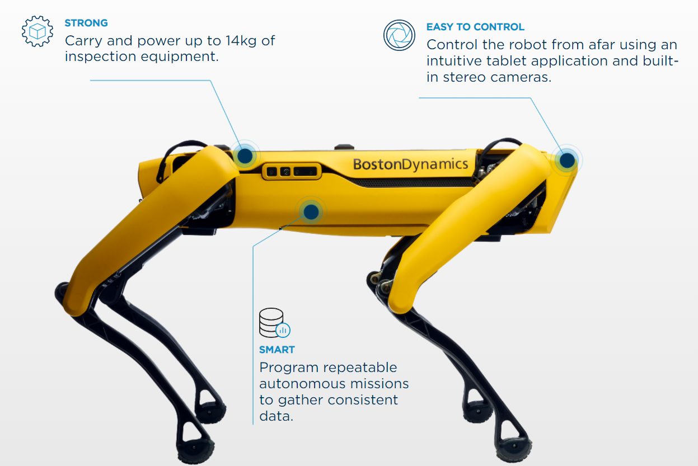

# Robots db

This is the Robots DB, that the 2022 winter semester class of _Digital Organization, Automation & Technology_ at [CBS International Business School](https://cbs.de) has put together.

This is our repository.

## Producers

### Boston Dynamics

Website: [https://www.bostondynamics.com/](https://www.bostondynamics.com/)

Headquarter: Waltham, Massachusetts, United States

Size of Company (Nb of Employees): 500

Representative Robot:

SPOT 
* Can navigate trough difficult terrain where it is hard for humans to enter

### Franka Emika

Website: [https://www.franka.de/](https://www.franka.de/)

Headquarter:

Size of Company (Nb of Employees):

Representative Robot:

### Horst

### Kuka

Website: [https://www.kuka.com/](https://www.kuka.com/)

## References and Interesting Reads

-

-
