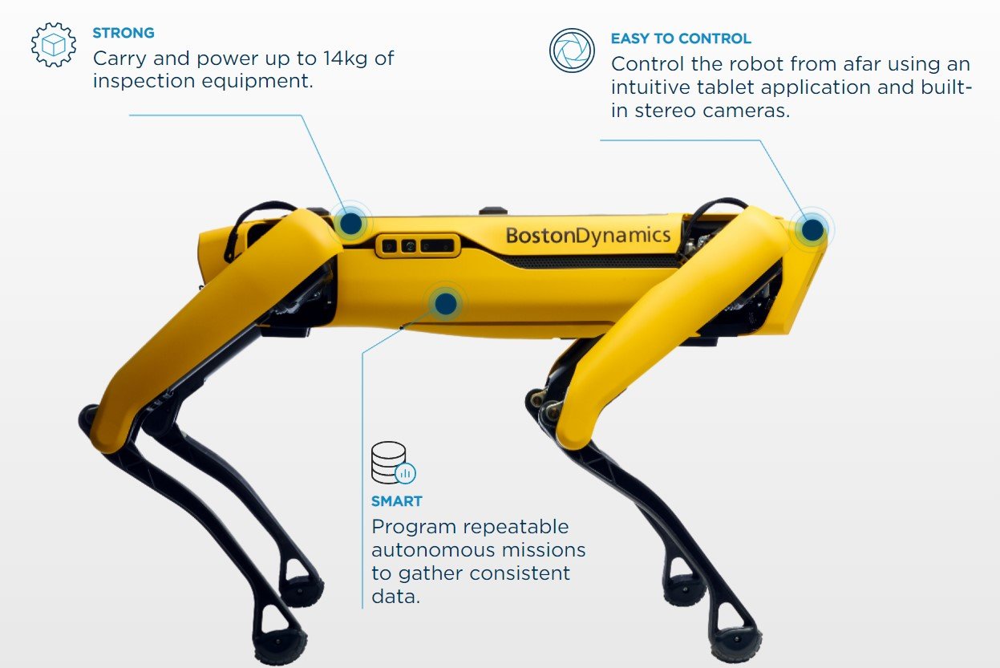
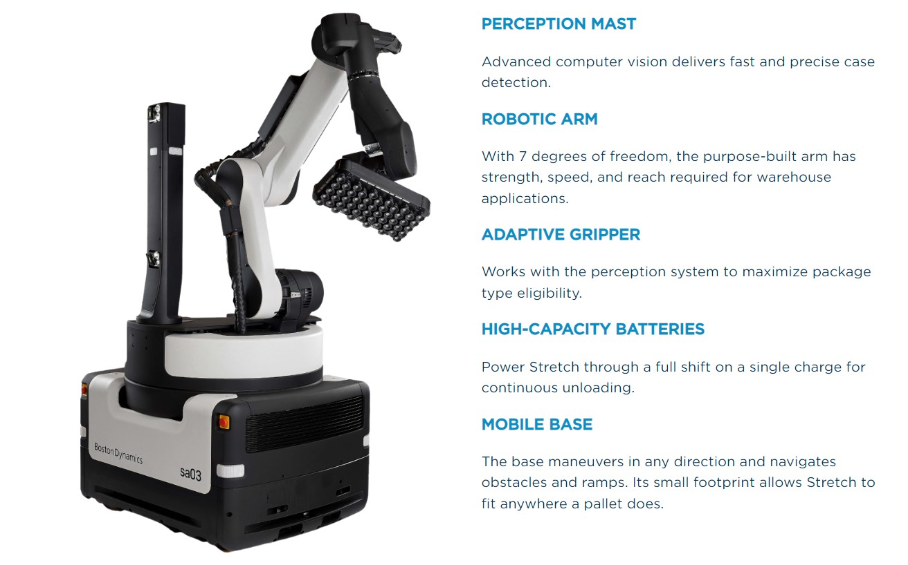
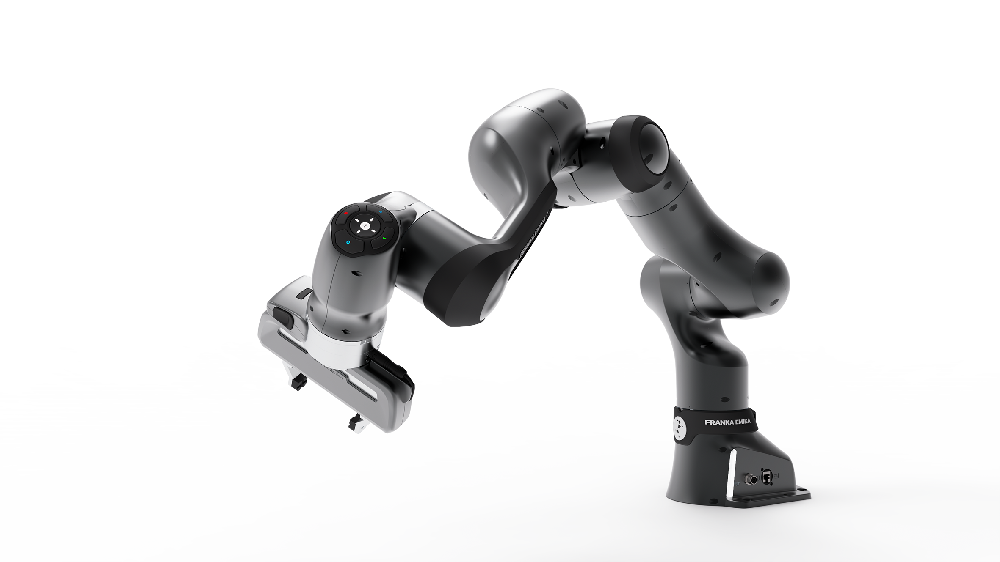
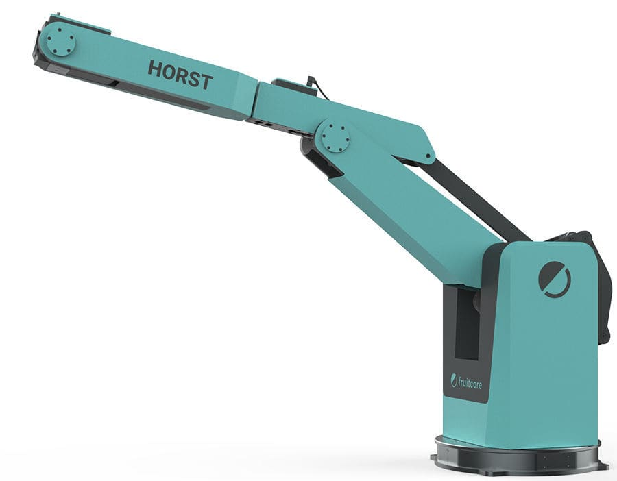
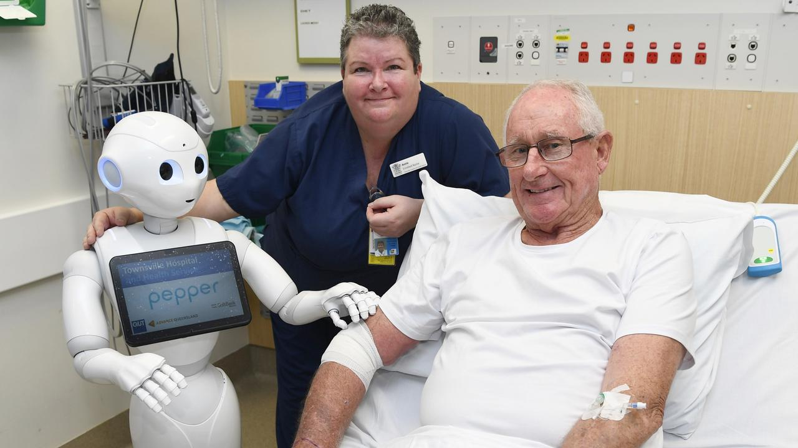

# Robots DB

This is the Robots DB, that the 2022 winter semester class of _Digital Organization, Automation & Technology_ at [CBS International Business School](https://cbs.de) has put together.

This is our repository.

## What Is Robotics?

Robotics is an engineering discipline that deals with the idea, design, construction, and operation of robots. The goal of robotics is to develop intelligent devices that can aid people in a number of ways.
Robotics may take many different shapes. A robot can be human-like or take the shape of a robotic application, such as robotic process automation, which mimics how humans interact with software to conduct repetitive, rules-based activities.

## History and Development of Robots

In the 1950s, inventor George Devol and engineer Joseph Engelberger developed *Unimate*, the first industrial robot. In the patent for "Programmed Article Transfer", which was granted in 1961, it reads as follows:

"The present invention relates to the automatic operation of machinery, particularly the handling apparatus, and to automatic control apparatus suited for such machinery."

In 1961, this robotic arm was used in General Motors production. The machine performed the task of transporting die-cast parts from an assembly line and then welding these parts to car bodies. Additionally, *Unimate* was also able of pouring drinks. How multifunctional the robot could be used can be seen in this [video](https://www.youtube.com/watch?v=hxsWeVtb-JQ).

In the following years other Robots were developed that were used in the automotive industry. In 1973, Kuka, a company from Augsburg, launched the first six-axis, purely electrically operated robot. A year later, the Swedish company Asea, now ABB, followed with a robotic arm that was programmed with a computer for the first time. In the subsequent two decades, besides Kuka and ABB, manufacturers such as Fanuc and Yaskawa established themselves in the robot market.

#### The characteristics of Cobots

A __cobot__ is an industrial robot that is designed to work together with humans. Therefore, the robot can be used in close vicinity to humans without the latter being exposed to a risk of injury. To guarantee this, the robots are limited to a minimum of their capabilities. The term __cobot__ is short for __collaborative robot__.

## Producers

Some of the major robot producers are:

* ABB 
* Boston Dynamics
* Fanuc 
* Franka Emika
* Fruitcore robotics
* Kuka

Below you can read more about the different producers.

---

# ABB 

Website: [https://new.abb.com/products/robotics](ABB)

Headquarters: Zürich, Switzerland 
Founded In : 1988 ,Sweden

---

## Products In Robotics and Automation:ABB
    - Industrial Robots
    - Collaborative Robots 
    - Autonomous Mobile Robots
    - Controllers
    - Machine Automation Solutions 
---

## Manufacturing Robots
 ABB offers Various Kinds Of Manufacturing Robots Based On Their Usage and Application
  - Articulated Robots
  - Collaborative Robots
  - Paint Robots
  - Picking and Packing Robots
  - Rapid Cycle Time Robots

---
## Articulated Robots:
ABB’s comprehensive 6-axis articulated robot portfolio delivers the ideal solutions for use in material handling, machine tending, spot welding, arc welding, cutting, assembling, testing, inspecting, dispensing, grinding, and polishing applications.

Its Payload Capacities Range From 4 Kgs to 800 Kgs

And Reach Of Arm Ranges From 0.58 Meters to 4.2 Meters In Length 

ARB 8700:Flagship Model

<iframe
    width="640"
    height="480"
    src="https://www.youtube.com/embed/cVaFG9kSksU"
    frameborder="0"
    allow="autoplay; encrypted-media"
    allowfullscreen
>
</iframe>

Features and benefits:
High payloads up to 1000 kg with the wrist down
25% faster speeds than other robots in this size class
Highly reliable with simplified design and Foundry Plus 2 protection standard
Built around LeanID for reduced wear on dress packs and ease of simulation
Built using non-hazardous materials

 
## Collaborative Robots:
 ABB’s collaborative robots are made for a wide range of tasks, in operations of every size. They’re easy to set up, program, operate, and scale. Built by industry-leading experts. And serviced by the broadest service network in the industry. Whatever you need, we’re here to support every step of your automation journey.

## Paint Robots
A complete range of paint robots to help you increase the productivity and quality of your paint shop operations. Designed for automotive interior & exterior painting, tiers, and general small & medium parts painting applications.

## Picking and Packing Robots
ABB’s Delta robot portfolio is the leader in state-of-the-art high-speed robotic picking and packing technology for use in the picking, packing, and packaging applications. Our delta robots offer the greatest flexibility in a compact footprint.

## Rapid Cycle Time Robots
Quick, precise, and reliable, ABB’s SCARA robots are ideal for customers requiring rapid cycle times, high precision, and high reliability for material handling, loading & unloading, picking & placing, and small part assembly & testing applications.

---

### Boston Dynamics

 

Website: [https://www.bostondynamics.com/](https://www.bostondynamics.com/)

Headquarter: Waltham, Massachusetts, United States

Size of Company (Nb of Employees): 500

Representative Robot:

SPOT 
* Can navigate trough difficult terrain where it is hard for humans to enter
* See [a video of the amazing things Spot can do](https://www.youtube.com/watch?v=wlkCQXHEgjA)

 

STRETCH 
* Robotic arm making automated warehouse handling more efficient
* See [a video of Stretch at work](https://www.youtube.com/watch?v=yYUuWWnfRsk)

 

Project for the future:

ATLAS
* 37 million people have seen [Atlas dancing](https://www.youtube.com/watch?v=fn3KWM1kuAw)
* Atlas is a human shaped robot with the ability to both dance and do parkour 
* If you want to know more about how and why, here is an [interesting and explanatory video](https://www.bostondynamics.com/atlas)

---

### Fanuc 

 

* Website: [https://www.fanuc.eu/de/en/](https://www.fanuc.eu/de/en)
* Headquarter: Oshino, Yamanashi, Japan
* Size of Company (Nb of Employees): 8,256 employees
* Revenue: 635.6 billion JPY (2019)

 
FANUC Robotics offers over one hundred models of industrial robots. Renowned for their easy-to-use, versatile products, FANUC is a leader in innovation.

Recently FANUC unveiled their new CRX series of cobots. These collaborative robotic arm units are streamlined with smart programming and highly-sensitive safety protocols, ensuring risk-free and straightforward
programming and operation.

FANUC is also well-known for their large and powerful M-2000iA series robotic arms. This “Ultra Heavy Payload” class has a working capacity of up to 2300 kg! Of course, they make arms of all sizes in between as well. Their Paint Series robotic arm uses a top-of-the-line hydraulic system that is powerful enough for automobile painting but delicate enough for smaller powder-coating jobs. Finally, their mid-range arms can do everything from pick-and-place to welding and machine tending. FANUC has a robot for virtually every automation need.

* The product range of FANUC includes:

    * Collaborative Robot
    * Genkotsu-robot, Mini Robot
    * Arc Welding Robot, Small/Medium Size Robot
    * Large Size Robot
    * Palletizing Robot, Others
    * Paint Robot

--- 

### Franka Emika

 

* Website: [https://www.franka.de/](https://www.franka.de/)
* Headquarter: Munich, Germany
* Founded In: 2017
* Size of Company (Nb of Employees): < 125
* Revenue: 10.73 Million Euro (2019)

Representative Robot:

Franka Production 3

* The Cobot is fully TÜV certified, thus, suitable for industry.
* The product consists of a gripper arm and the associated app.
* The robot characterized by its high flexibility, since it has seven axes and is equipped with more than a hundred different sensors.
* It is capable of lifting 3 kg and has a reach of 833 mm.
* The product is mainly implemented in areas of process automation of industrial production.

### Fruitcore robotics

 

* Website: [https://fruitcore-robotics.com/]
* Headquarter: Konstanz, Germany
* Size of the Company (Nb of Employees): approximately 100

Representative Robot:

HORST1400

The Horst1400 is a six-axis industrial robot. The product is easy to use and very powerful. Due to a developed drive concept, which is based on a four link chain, promises the balance between the reach and the payload of the robot.
The Horst1400 is particularly suitable for applications in logistics, transport and processing of plastic or metal parts and other tasks that require high absolute and repeat accuracy.

---

### Kuka

 

Website: [https://www.kuka.com/](https://www.kuka.com/)

Headquarter: Augsburg, Germany 

Size of Company (Nb of Employees): 14,000 employees

Representative Robot:

Industrial Robots 
* different robot types depending on payload (kg) and reach (mm)
    * e.g. KR Quantec (120-300 kg & 2671-3904 mm) or Linearrobot (16-600 kg & 0-45000m)

---

## Industries Utilizing Robotics: :robot:

* [Healtchcare sector](https://www.youtube.com/watch?v=ZM1GZSO7MYs)
    * Surgery robots (like [da Vinci Xi](https://www.youtube.com/watch?v=H4WzUSq9OeY))
    * Therapy robots (like [Paro](https://www.youtube.com/watch?v=2ZUn9qtG8ow) for dementia; rehabilitation robots)
    * assistive robots 
    * social robots (e.g. humanoid robots [Pepper](https://www.youtube.com/watch?v=zJHyaD1psMc) or [NAO](https://www.youtube.com/watch?v=2STTNYNF4lk)) 
* [Manufacturing e.g. Automotive Industry](https://www.youtube.com/watch?v=P7fi4hP_y80)
    * consist mainly of mechanical arms tasked with pick and place (other examples: robotic welding machine, palletizing robot arm, automatic painting robot,...)
* [Agriculture](https://www.youtube.com/watch?v=bd9JZXscOIE)
    * In agriculture, robots are mainly used for harvesting and picking. The advantages of robots are that they work particularly quickly and accurately. Consequently, they contribute to improving harvest yields and reducing fruit wastage.
*  [Military](https://www.youtube.com/watch?v=uXGj1kZnFEg)
    * Military robots use artificial intelligence for carrying out different tasks like picking off snipers, target acquisition, climbing ladders, operating in disaster situations, explosive ordnance disposal, search and rescue, fire fighting, and many more.

* Further examples: 
    * Aerospace
    * Beverage
    * Computers
    * Consumer goods
    * E-Commerce
    * Electronics
    * Food
    * Grocery
    * Hardware
    * Liquor distribution
    * Medical products
    * Pharmaceutical
    * Quality control and inspection
    * Retail
    * Warehousing and distribution

## Application of robots in the healthcare sector 

* __Surgical-Assistance Robots__
    * Surgical assist robots support surgeons performing complex operations using AI and computer vision-enabled technologies, thereby achieving new levels of speed and accuracy. The ability to use video transmission from the operating room to other locations nearby or far away also allows surgeons to consult with other specialists in their field. This allows patients to include the best surgeons in their procedures and increases the quality of care patients receive. Some surgical robots may even be able to perform tasks autonomously, allowing surgeons to monitor procedures from a console.
    * Currently, surgical assistance robots are mainly used in orthopedic surgery and for minimally invasive operations in the upper body. 
    [watch surgical robots in action](https://www.youtube.com/watch?v=2fnv_3qn3Yc)

* __Modular Robots__
    * Modular robots complement other systems and can be configured to perform different tasks and assist in rehabilitation, for example.  In healthcare, these include therapeutic exoskeleton robots and prosthetic robotic arms and legs.

* __Nursing Robots__
    * The use of robots in care is much more diverse. There are care robots such as Pepper, which communicates with people in need of care as a humanoid robot *(social robot)* and makes their daily lives easier and can also mentally activate its counterpart. Furthermore, care robots *(collaborative)* are used for heavy physical activities in care, such as turning or changing the position of patients, in order to spare the nursing staff. In addition to relieving the physical strain, the use of such robots also requires fewer nursing staff due to increased efficiency.
    * 

## Application of robots in agriculture 

Robots in agriculture help improve both productivity and sustainability. They can specialize by for example only spraying plants that need pesticides with pesticides, and leave the nearby plants alone, [like this](https://www.youtube.com/watch?v=Qg9Zubc7lok). They also improve the working conditions for the farmers. 

Robots can be used for harvesting fruits, [like this robot picking grapes](https://www.youtube.com/watch?v=hVvs6_Wx2HM). Or for collecting information, [for example differentiating weeds form corns](https://www.youtube.com/watch?v=eof99XfoFfY). 

When it comes to research and development some of the [Robotnik](https://robotnik.eu/robotics-applications-in-agriculture/) projects are BACCHUS, AGROBOFOOD and CORSECT. Where Bacchus has the ability to both collet data and do harvesting at the same time. While Agrobofood aims do create a digital transformation in the agricultural sector. Corsect on the other hand works on optimizing insect production. 

According to [Owen-Hill (2022)](https://blog.robotiq.com/top-10-robotic-applications-in-the-agricultural-industry) the top 10 Applications of Robotis agriculture is: 

1. Nursery Planting: [being able to plant 10 000 cuttings per hour.](https://www.youtube.com/watch?v=Xy0yOBszN1k)
2. Crop Seeding: [with high precision.](https://www.youtube.com/watch?v=OoUGSb-ASTc)
3. Crop monitoring and Analysis: [being able to look at every single plant.](https://www.youtube.com/watch?v=STlXFht8-5w)
4. Fertilizing and Irrigation: [simple but helpful Cron Fertilizing robot.](https://www.youtube.com/watch?v=STlXFht8-5w)
5. Crop Weeding and spraying: [like this.](https://www.youtube.com/watch?v=Qg9Zubc7lok)
6. Thinning and Pruning: [with the award winning LettuceBot.](https://www.youtube.com/watch?v=jL4kcrumHA8)
7. Autonomous Tractors: [both compact and zero emission.](https://www.youtube.com/watch?v=gMaQq_vRaa8)
8. Picking and harvesting: [like this robot picking grapes.](https://www.youtube.com/watch?v=hVvs6_Wx2HM)
9. Shepherding and Herding: [with "robot dog".](https://www.youtube.com/watch?v=gD7K6-q-o50)
10. Milking: [both reducing need for labour and stress for the cow.](https://www.youtube.com/watch?v=tLjI_eixBQk)
    
## Advantages of robots

* In some situations, they can improve productivity, efficiency, quality, and consistency.
* Robots, unlike humans, do not become bored.
* They may continually repeat the same procedure till they wear out.
* Robots can be used to perform monotonous work, giving humans more time to focus on critical aspects or creative tasks. 
* Robots can operate in hazardous conditions, such as with harmful chemicals or in places with high radiation.
* Robots can also work in extreme environments, whether underwater, in extreme heat, in wind, or even in space. And they can be used wherever human safety is at risk.
* They may be exceedingly exact, down to fractions of an inch, which makes them very valuable in the manufacture of microelectronics. Some robots have sensors and actuators that outperform humans.
* They do not have the same physical or environmental demands as humans.

## Disadvantages of robots

* Robots are displacing human workers in various areas, which might cause economic concerns.
* Robots can exclusively handle tasks, but they usually cannot deal with unexpected situations.
* Because of current robotics technology, most machines are less dexterous than humans and cannot compete with humans' capacity to comprehend what they perceive. But researchers are working on producing robots that can better detect their surroundings.
* Overall, robots can only perform what they are taught to do, which means they cannot improvise (although AI and machine learning is changing this).
* Robots with practical applications are typically costly in terms of original cost, maintenance, the requirement for additional components, and the need to be programmed to perform the task.
* Robots have no emotions and have no conscience. As a result, empathy in the workplace decreases.
* Legal  challenges  in  robots  have  been  a  topic  of  debate  for  many  decades.  As mentioned earlier someone  must be held  accountable for any  crime committed by robots.

## Conclusion 

Robots may be one of the greatest inventions ever, but we must utilise their power with prudence. Perhaps it is a good idea to have industrial robots that can reduce human danger, raise production, and increase profit. But it is insane to design or build anything that threatens the very existence of its creator. Although humanoid robots are still primarily confined to science fiction, robotic devices are all around us. These engineering marvels currently assist us in many aspects of life and have the potential to influence our future.

Despite a number of advantages and downsides, one thing is certain: persons with robotics expertise will be in great demand in the future. There will almost certainly always be work in the field of robotics, whether it be designing, programming, or maintaining robots.

---

## References and Interesting Reads

- FANUC | The Factory Automation Company - Fanuc. (n.d.). Retrieved October 11, 2022, from https://www.fanuc.eu/de/en

- Robotnik | Robotics applications in agriculture. Retrieved October 26, 2022, from https://robotnik.eu/robotics-applications-in-agriculture/
